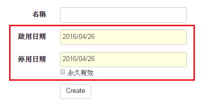
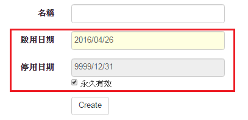
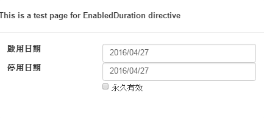

## Introduction

What are directive?

> Directives are markers on a DOM element (such as an attribute, element name, comment or CSS class) that tell AngularJS's HTML compiler ($compile) to attach a specified behavior to that DOM element (e.g. via event listeners), or even to transform the DOM element and its children. 
> - from [docs.angularjs.org](https://docs.angularjs.org/guide/directive)


## Background

There are two or more pages that contain the same elements and behavior on them. For example, the following 2 textboxes and checkbox appear in multiple pages, and we would like to make the HTML and javascript reusable.






In this sample, we will create directives for this input block.


## Implement : Create reusable directive


### HTML

```
<div class="form-horizontal" ng-app="app" ng-controller="CreateCtrl">
<div class="form-group">
    <label class="control-label col-md-2" for="EnabledOn">啟用日期</label>
    <div class="col-md-10">
        <input type="datetime" enabledon ng-model="EnabledOn"/>
    </div>
</div>

<div class="form-group">
    <label class="control-label col-md-2">停用日期</label>
    <div  class="col-md-10">
        <table width="100%">
            <tr>
                <td>
                    <input type="datetime" disabledon ng-disabled="disabledDisabledOn" ng-model="DisabledOn" />
                </td>
            </tr>
            <tr>
                <td>
                    <input type="checkbox" ng-model="Permanent" ng-checked="checkedPermanent" />&nbsp;永久有效
                </td>
            </tr>

        </table>
    </div>
</div>
</div>
```


### AngularJS - Directive


* directive-enabled-on.js

```
angular.module('enabledonapp', [])
.directive('enabledon', function () {
    return {
        scope: true,
        link: function ($scope) {

        },
        controller: function ($scope, $element) {
            //Initialize
            var date = new Date();
            $scope.EnabledOn = moment(date).format('YYYY/MM/DD');
        }
    }
});
```

* directive-disable-on.js

```
angular.module('disabledonapp', [])
.directive('disabledon', function () {
    return {
        scope: true,
        link: function ($scope) {
           
            //當勾選/取消 永久有效 (Checkbox)
            $scope.$watch("Permanent", function (newValue, oldValue) {

                if (newValue == true) {
                    $scope.DisabledOn = '9999/12/31'
                    $scope.disabledDisabledOn = true;
                }
                else {
                    var date = new Date();
                    $scope.DisabledOn = moment(date).format('YYYY/MM/DD');
                    $scope.disabledDisabledOn = false;
                }
            });
        },
        controller: function($scope, $element) {
            //The watch can put here, it will execute before link function.

            $scope.checkedPermanent = false; //ng-check for Checkbox : 永久有效
            $scope.disabledDisabledOn = false; //ng-disable for Textbox : 停用日期

            //Initialize
            var date = new Date();
            $scope.DisabledOn = moment(date).format('YYYY/MM/DD');
        }
    }
});
```

**Important!!**

While creating directive, the parameters are defined as following.


| scope | 1. "false" : Use the parent scope. <br />2. "true"  : Use the child scope inherit from the parent and which aren't relevant to other directives.<br />3. "{}"    : Isolated scope.
| link | A function that contains the core logic of the directive. |
| controller | Controller for the directive. |


For the difference between link and controller, you can take a look at [this article](http://stackoverflow.com/questions/12546945/difference-between-the-controller-link-and-compile-functions-when-definin) on StackOverflow.


### AngularJS - Controller

```
var app =
angular.module('app', ['disabledonapp', 'enabledonapp'])
.controller('CreateCtrl', function ($scope, $http, $q) {

});
```


## Implement : Create reusable HTML

Since we have the directive, it’s time to make the HTML reusable.
Fortunately, we can reach goal by Directive as well.

In the following sample, I will create only one directive for the input block which contain 2 textboxes and a checkbox.


### HTML

* Main Html

```
<div ng-app="app" ng-controller="EnabledDurationCtrl">
        <b>This is a test page for EnabledDuration directive</b>
        <hr />
        <div enabledduration>
        </div>
    </div>
```

* EnabledDurationPartialView.html : reusable HTML (input block inside)

```
<div class="form-group">
    <label class="control-label col-md-2" for="EnabledOn">啟用日期</label>
    <div class="col-md-10">
        <input type="datetime" ng-model="EnabledOn"/>
    </div>
</div>

<div class="form-group">
    <label class="control-label col-md-2">停用日期</label>
    <div  class="col-md-10">
        <table width="100%">
            <tr>
                <td>
                    <input type="datetime" ng-disabled="disabledDisabledOn" ng-model="DisabledOn" />
                </td>
            </tr>
            <tr>
                <td>
                    <input type="checkbox" ng-model="Permanent" ng-checked="checkedPermanent" />&nbsp;永久有效
                </td>
            </tr>

        </table>
    </div>
</div>
```

### AngularJS : Directive

```
angular.module('enableddurationapp', [])
.directive('enabledduration', function () {
    return {
        scope: true,
        templateUrl: '/HTML/EnabledDurationPartialView.html',
        link: function ($scope) {
           
            //當勾選/取消 永久有效 (Checkbox)
            $scope.$watch("Permanent", function (newValue, oldValue) {

                if (newValue == true) {
                    $scope.DisabledOn = '9999/12/31'
                    $scope.disabledDisabledOn = true;
                }
                else {
                    var date = new Date();
                    $scope.DisabledOn = moment(date).format('YYYY/MM/DD');
                    $scope.disabledDisabledOn = false;
                }
            });
        },
        controller: function($scope, $element) {
            //The watch can put here, it will execute before link function.

            $scope.checkedPermanent = false; //ng-check for Checkbox : 永久有效
            $scope.disabledDisabledOn = false; //ng-disable for Textbox : 停用日期

            //Initialize
            var date = new Date();
            $scope.EnabledOn = moment(date).format('YYYY/MM/DD');
            $scope.DisabledOn = moment(date).format('YYYY/MM/DD');
        }
    }
});
```

Here we use `templateUrl` to include the reusable HTML in the directive.

The following picture shows the result.





## Reference
1. [Custom Directives in AngularJS](http://www.c-sharpcorner.com/UploadFile/dev4634/custom-directive-in-angular-js983/)