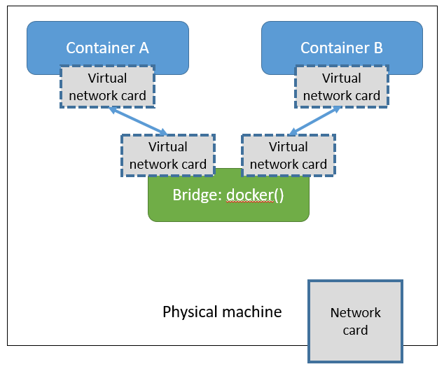

# Implemetation on kernel

## Base

- [Linux Container(LXC)](https://linuxcontainers.org/)
- [libcontainer]()


> [Difference between LXC and libcontainer](https://stackoverflow.com/a/34155329/7045253)


## Docker Daemon

`Docker Daemon` runs on the host and in charge of handling the client's requests, such as creating, running the contianers.

Docker host listens to `unix://var.run/docker.socket` and only allow to be used by the `root` user or users in docker's user group.


The following command can change the `Docker Daemon`'s default listening port to `1234`. 

```
$ docker daemon -H 0.0.0.0:1234 
```


On the client side, connet to the Docker host with port: 1234

```
$ docker -H 127.0.0.1:1234 version
```

Notice that in order to decrease the responsibility of `Docker Daemon` on both API handling and conatiner managing, the  newer version of Docker started using [`containerd`](https://github.com/containerd/containerd) to manage the containers. 
So that when the `Docker Daemon` is down, the containers will still be alive.   


## namespace

Docker uses many Linux namespace technologies for isolation.
Here are some of the most important ones. 


### PID(Process Id)

The same process(task_struct) will has different PID in different namespaces.

PID namespace isolates the process ID number space, so that processes in different PID namespaces can have the same PID.
It provides functionality such as suspending or resuming processes in the container and the processes inside the container will remain the same PIDs when migrating to a new host.

To see the PID of a container:

```
$ docker inspect --format '{{.State.Pid}}' <container>
3207
```

Or use [`docker top`](https://docs.docker.com/engine/reference/commandline/top/)

```
$ docker top <container>
PID                 USER                COMMAND
3207                root                {run.sh} /bin/bash /run.sh
3264                root                /usr/sbin/sshd -D

$ docker top <container> -o pid -o ppid
PID                 PPID
3207                3179
3264                3207
```


### Network namespace(網路命名空間)

 Docker uses Linux network namespace and each container has its own network namespace, that means it has its own IP address, routing table, etc.

 

 

### IPC(Interprocesses Communication) 

### Mount

### UTS(UNIX Time-sharing System)

### User


## CGroups

Control group 