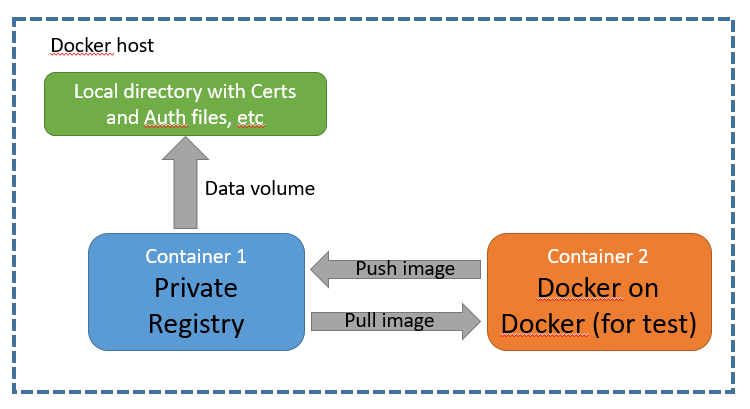

# Private Docker Registry

> The Registry is a stateless, highly scalable server side application that stores and lets you distribute Docker images. (See reference: [Docker Registry](https://docs.docker.com/registry/))

We are going to use the official Docker image: [registry](https://hub.docker.com/_/registry/) to create our private Docker Registry. 


## Install Docker Registry

The docker image can be found on [Docker Hub](https://hub.docker.com/_/registry/)

```
$ docker run -d -p 5000:5000 --restart=always --name <container name> registry[:<tag>]
```

For example, to put the private images in local directory:

```
docker run -d -p 5000:5000 \
              --restart=always
              --name my-registry
              -v /opt/data/registry:/var/lib/registry \
              registry
```

### Push image

```
$ docker tag <image name>:<tag> 192.123.45.678:5000/<name>[:tag]
$ docker push 192.123.45.678:5000/<name>[:tag]
```

ex.
```
$ docker tag centos:latest 192.123.45.678:5000/centos
$ docker push 192.123.45.678:5000/centos
$ curl http://$(docker-machine ip default):5000/v2/_catalog 
```

The pushing result will be like this,




### Pull image

```
$ docker pull 192.123.45.678:5000/<name>[:tag]
```

ex. 
```
$ docker pull 192.123.45.678:5000/centos
```


add-apt-repository "deb [arch=amd64] https://download.docker.com/linux/ubuntu $(lsb_release -cs) stable"
## Make local TLS certificate

```
$ openssl req -newkey rsa:4096 -nodes -sha256 -keyout certs/jb.key -x509 -days 365 -out certs/jb.crt
```


```
docker run -d -p 443:443 \
              --restart=always
              --name my-registry
              -v /opt/data/registry:/var/lib/registry \

              -e REGISTRY_HTTP_ADDR=0.0.0.0:443 \
              -e REGISTRY_HTTP_TLS_CERTIFICATE=/opt/data/registry/certs/<domain>.crt \
              -e REGISTRY_HTTP_TLS_KEY=/opt/data/registry/certs/<domain>.key \
              registry
```

docker run -d -p 443:443 \
              --restart=always \
              --name my-registry  \
              -v /registry:/var/lib/registry \
              -e REGISTRY_HTTP_ADDR=0.0.0.0:443 \
              -e REGISTRY_HTTP_TLS_CERTIFICATE=/registry/certs/jb.crt \
              -e REGISTRY_HTTP_TLS_KEY=/registry/certs/jb.key \
              registry:2.6.2


## Reference

- [docker.github.io](https://github.com/docker/docker.github.io/blob/master/registry/deploying.md)
- [Running your own Docker Registry](https://www.admintome.com/blog/running-your-own-docker-registry/)