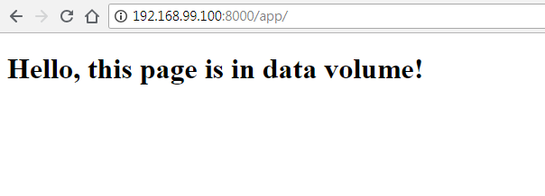

# Web Server

We are going to create a container as a [Apache](https://httpd.apache.org/) web server.  

## Create Dockerfile with [httpd](https://hub.docker.com/_/httpd/)

> [httpd](https://hub.docker.com/_/httpd/) is an image of Apache HTTP Server

```
$ mkdir -p apache-webserver/public-html
$ cd apache-webserver
$ touch Dockerfile public-html/index.html
```

* Dockerfile

```
FROM httpd:2.4
COPY ./public-html/ /usr/local/apache2/htdocs/
```

* index.html

```
<!DOCTYPE html>
<html\>
<head>
    <meta charset="utf-8" />
    <title></title>
</head>
<body>
    <h1>Hello, Docker!</h1>
</body> 
</html>
```

### Build Dockerfile to image

```
$ docker build -t apache2-webserver:0.01 .
```

### Run the container

```
$ docker run -dit --name my-apache -p 8000:80 apache2-webserver:0.01
```

Now connect to `http://$(docker-machine ip default):8000`

```
$ curl http://192.168.99.200:8080
```

which will get the following result,


## Custom the image

Now lets cutomize the previous image, `apache2-webserver`, to support both `SSH` and `Apache web server`.

### Directory and files


```
$ mkdir -p apache-webserver-ssh/sample
$ cd apache-webserver-ssh
$ touch Dockerfile run.sh sample/index.html
```

* index.html

```
<!DOCTYPE html>
  <html\>
    <head>
        <meta charset="utf-8" />
        <title></title>
    </head>
    <body>
        <h1>Hello, Docker!</h1>
    </body> 
</html>
```


* run.sh

```
#!/bin/bash
/usr/sbin/sshd &
exec apache2 -D FOREGROUND
``` 


* Dockerfile

```
FROM apache2-webserver:0.01

MAINTAINER <docker_user> (docker_user@xxx.com)

# Set environment variables
ENV TZ 'Asia/Taipei'
ENV DEBIAN_FRONTEND noninteractive

# Start RUN commands

# 1.Install
RUN apt-get update
RUN apt-get -yq install apache2
RUN rm -rf /var/lib/apt/lists/*


# 2.Update the settings of timezone (cus in docker image, it often not set it in default)
RUN echo $TZ > /etc/timezone && dpkg-reconfigure -f noninteractive tzdata

# 3.Create run.sh
ADD run.sh /run.sh
RUN chmod 755 /*.sh

# 4.Create a website and set link to /var/www/html
RUN mkdir -p /var/lock/apache2 && mkdir -p /app
RUN rm -fr /var/www/html
RUN mkdir -p /var/www/html
RUN ln -s /app/index.html /var/www/html/index.html
COPY sample/ /app


# Environment variables for Apache
ENV APACHE_RUN_USER www-data 
ENV APACHE_RUN_GROUP www-data 
ENV APACHE_LOG_DIR /var/log/apache2 
ENV APACHE_PID_FILE /var/run/apache2.pid
ENV APACHE_RUN_DIR /var/run/apache2 
ENV APACHE_LOCK_DIR /var/lock/apache2 
ENV APACHE_SERVERADMIN admin@localhost 
ENV APACHE_SERVERNAME localhost 
ENV APACHE_SERVERALIAS docker.localhost 
ENV APACHE_DOCUMENTROOT /var/www 

EXPOSE 80
WORKDIR /app
CMD ["/run.sh"]

```


> Current directories and files:
>
> `$ tree .`
> 

> To use Windows's tree, type `$ cmd //c tree .`


### Build Dockerfile to image

```
$ docker build -t apache2-webserver:0.02 .
```

### Run the container

```
$ docker run -dit -p 8000:80 -p 33:22 --name my-apache apache2-webserver:0.02
$ docker container port my-apache
```


## Use host's data volume

Create local directories and html file.

> Notice if you encounter the problem of not seeing the folders/files of data volume in the container, checkout my this [trouble-shooting post]().

```
$ mkdir -p /www/html
$ touch /www/html/index.html
```

* index.html

```
<!DOCTYPE html>
  <html\>
    <head><meta charset="utf-8" /><title</title></head>
    <body>
        <h1>Hello, this page is in data volume!</h1>
    </boy> 
</html>

```


Run the container and set the data volume mapping.

```
$ docker run -i -d -p 8000:80 -p 33:22 -e APACHE_SERVERNAME=mytest -v "/www/html":/app:ro --name my-apache apache2-webserver:0.02
$ docker exec -it my-apache /bin/bash
root@xxxx:/app# ls
html
root@xxxx:/app# ls html
index.html
```

And what we see is the content from host's index.html.




