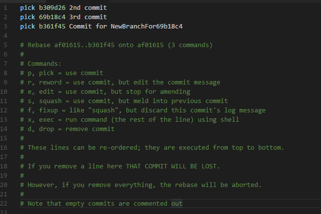

# Commit

## Track all files in this repository

```
$ git add --all
```

## Track only all files in current path, including of sub-directories

```
$ git add .
```


## Remove the file and track it 

```
$ git rm xxx.file
```
  
  Which equals to 

```
$ del xxx.file
$ git add xxx.file
```

## Rename the file and track it

```
$ git mv xxx.file yyy.file
```

  Which equals to 

```
mv xxx.file yyy.file
git add --all
```

## Untrack the file already committed

```
$ git rm xxx.file --cached
```


## Amend the last commit’s message 

```
$ git commit --amend -m “Refine message"
```


## Add tracked file to the last commit

```
$ git add zzz.html
$ git commit --amend --no-edit
```

## Update the commit history
```
$ git rebase -i {begin_sha-1_code}
```

  which will open the default git editor

  
