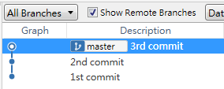
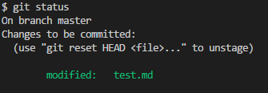

# Environment

2.16.2


## Initialize and configuration

- Initialize
```
$ git init
```

- Configure
```
$ git config --global -e
```

- Use VSCODE for default git editor ([reference](https://stackoverflow.com/a/36644561/7045253))
```
$ git config --global core.editor "code --wait"
```


## Commit

- Track all files in this repository

```
$ git add --all
```

- Track only all files in current path, including of sub-directories

```
$ git add .
```


- Remove the file and track it 

```
$ git rm xxx.file
```
  
  Which equals to 

```
$ del xxx.file
$ git add xxx.file
```

- Rename the file and track it

```
$ git mv xxx.file yyy.file
```

  Which equals to 

```
mv xxx.file yyy.file
git add --all
```

- Untrack the file already committed

```
$ git rm xxx.file --cached
```


- Amend the last commit’s message 
```
$ git commit --amend -m “Refine message"
```


- Add tracked file to the last commit
```
$ git add zzz.html
$ git commit --amend --no-edit
```

- Update the commit history
```
$ git rebase -i {begin_sha-1_code}
```

  which will open the default git editor

  

## Diff


- Compare working tree to index
```
git diff
```
  
- Compare index to HEAD  
```
git diff --cached
```

- Compare working tree to HEAD
```
git diff HEAD
```

## Reset

- Checkout file for latest commit
```
$ git checkout xxx.file
```

- Reset to relative commit (^: previous commit)
```
$ git reset {sha1-code}^
``` 

or

```
$ git reset {sha1-code}~1
```

> *Git reset modes*
> 
> * mixed (Default)
>
>   Revert current changes index, but keep them on working tree
>
> * soft
>
>   Revert current changes index, but keep them on working tree
>
> * hard
>
>   Revert current changes on working tree and index
>

- Reset modes example

  Commit 3 times as following,

  

  


  Then make changes and add to index. The diff results ...

  `git diff` (Compare working tree to index)
  
  No difference

  `git diff --cached` (Compare index to HEAD)

  

  `git diff HEAD` (Compare working tree to HEAD)

  


  Now reset the the 1st commit and see the differences between 3 modes

  * mixed 

    ```
    $ git reset --mixed af01615
    ```
    
    

    

    ps. `git diff --cached` will get nothing.


  * soft 

    ```
    $ git reset --soft af01615
    ```

    

    
    
    ps. `git diff` will get nothing. 


  * hard

    ```
    $ git reset --hard af01615
    ```

    
    
    ps. `git diff`,  `git diff --cached`,  `git diff HEAD` will all get nothing. 

## Log

```
$ git log --oneline --graph
```

```
$ git log --author="JB" 
```

```
$ git log --after="2018-03-02" --since="10am" --until="18pm"
```

- Search commit messages
```
$ git log --grep="Fix bugs"
```

- See commit logs for every line in a file
```
$ git blame xxx.file
```

- See commit logs for certain lines in a file
```
$ git blame -L 10,20 xxx.file
```

- reflog: show commit and head moving logs
```
$ git reflog
```

- list files
```
$ git ls-files -s
```

## Branch

- Create new branch
```
$ git branch {new_branch_name}
```

- Checkout branch or create new branch if not exist
```
$ git checkout -b {branch_name}
``` 

- Rename branch
```
$ git branch -m {old_branch_name} {new_branch_name}
```

- Delete branch
```
$ git branch -d {branch_name}
```

- Delete branch (force)
```
$ git branch -D {branch_name}
```

- Checkout certain commit and create branch from it
```
$ git checkout {sha-1 code}
$ git branch {new_branch_name}
```

  or one line like this 

```
$ git branch {new_branch_name} {sha-1 code}
```   


## Tag

- Create lightweight tag (for private or temporary purpose)
```
$ git tag {tag_name} {sha-1_code}
``` 

- Create annotated tag (for release or milestones)
```
$ git tag {tag_name} {sha-1_code} -a -m "some comments for annotated tag..."
```

- List tags
```
$ git tag -l
```

- Delete tag
```
$ git tag -d {tag_name}
```

- Use alias to create tag
```
$ git config alias.XXXX '!git tag MyTag-$(date +"%Y-%m-%d_%H-%M-%S")'
$ git XXXX {sha-1_code}
```


## Merge branches

```
$ git checkout {source_branch}
$ git merge {target_branch}
```

if conflict...

- Apply source ones
```
$ git checkout --ours xxx.file
$ git add xxx.file
$ git commit -m "...."
``` 

- Apply target ones
```
$ git checkout --theirs xxx.file
$ git add xxx.file
$ git commit -m "...."
``` 

## Rebase branches

```
$ git checkout {source_branch}
$ git rebase {target_branch}
```

if conflict, use the same commands on *Merge Branch* and then 
```
$ git rebase --continue
```


## .gitignore

- Ignore single file

`xxx.log`

- Ignore ./Logs/xxx.log

`Logs/xxx.log`

- Ignore all *.log in any folder named Logs

`/Logs/*.log`

- Ignore all .log files

`*.log`


