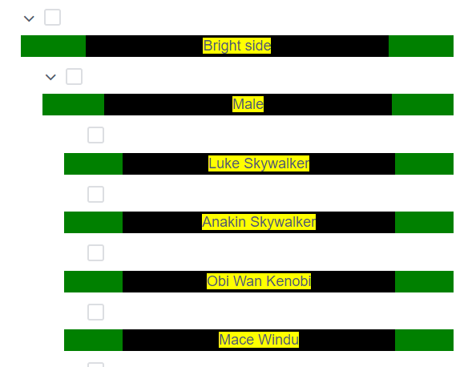

# iView - Tree

> 一套基於 Vue.js 的高質量UI 組件庫，此篇介紹Tree(樹狀顯示器)


## Github

[iview/iview](https://github.com/iview/iview)


## 範例

### HTML

```html
<tree :data="starwars" @on-select-change="selected"></tree>
```

### JS

以階層的方式定義資料：
* `title`: 顯示的值
* `children`: 下一階層的資料
* `expand`: Boolean，預設是否顯示下一層，預設為`false`
* `disabled: true`: 禁用該筆資料 (Optional)

並可綁定`on-select-change`事件以取得被選取的節點。


```javascript
const FOO_DATA = [
    {
        title: 'Bright side',expand: true,
        children: [
            {
                title: 'Male', expand: true,
                children: [
                    { title: 'Luke Skywalker', img: 'https://goo.gl/KEUxHN' }
                ]
            },
            {
                title: 'Female', expand: true,
                children: [
                    { title: 'Leia Skywalker', img: 'https://goo.gl/rNJhLU' }
                ]
            }
        ]
    },
    {
        title: 'Dark side', expand:false,
        children: [
            {
                title: 'Male',
                children: [
                    { title: 'Darth Vader', img: 'https://goo.gl/xcMHqj' }
                ]
            },
            {
                title:'Female', disabled: true,
                children: [
                    { title: 'Asajj Ventress', img: 'https://goo.gl/pr19sJ' }
                ]
            }
        ]
    }

];


var app = new Vue({
    el: "#app",
    data: {
        starwars: [],
        selectedNode: null,
    },
    methods: {
        selected(selectedItem){
            this.selectedNode = selectedItem[0];
            alert(`You select ${this.selectedNode.title}`);
        }
    },
    created() {
        this.starwars = FOO_DATA;
    }
})
```


### 加入Checkbox

設定`show-checkbox`並綁定`on-check-change`事件：

```html
<tree :data="starwars"  show-checkbox  @on-check-change="checked"></tree>
```

注意`on-check-change`對應函式傳入的參數為所有已勾選的節點。
至於父層節點需要所有子節點皆為已勾選後，其'checked'才會為`true`。

```javascript
var app = new Vue({
    el: "#app",
    data: {
        starwars: [],
        checkedNodes: [] //All checked nodes
    },
    methods: {
        checked(checkedItems) {
            this.checkedNodes = checkedItems;
        }
    },
    created() {
        this.starwars = FOO_DATA;
    }
})
```

Demo:


也可透過遞迴手動取得所有已勾選的節點：

```javascript
methods: {
    checked(checkedItems) {
        // Get all checked nodes manually by recursive 
        this.checkedNodes = [];
        this.visit(this.starwars);
    },
    visit(nodes) {
        nodes.forEach(node => {

            if (node.checked === true) {
                this.checkedNodes.push(node);
            }

            if (node.children)
                this.visit(node.children);
            else
                return
        });

    }
}
```


### 客製節點內容

利用Prop:`render`，我們可以在每個節點前加上圖示，及後面加上按鈕。

```html
<tree :data="starwars" :render="renderContent"></tree>
```

`renderContent`傳入的第二個參數內含：

| Param | Type | Description |
|:------|:----:|:------------|
| root | array  | 根節點 |
| node | object | 當前節點 |
| data | object | 當前節點的資料 | 


而回傳的內容即在組合節點的HTML，其方式如下：

```
h('<current html's tag>', {<current html's props/style/event>}, [<inner html's h(...)>])
```

如果是最內層的方法記得放上`data.title`


先看個說明的例子：

```javascript
renderContent(h, { root, node, data }) {
    return h('center', {
        style: { width: '100%',backgroundColor: 'green'}}, 
        [
            h('center', {
                style: { width: '70%', backgroundColor: 'black' }},
                [
                    h('span', { style: {width: '30%', backgroundColor: 'yellow' } }, data.title)
                ] 
            ),
        ]
    );
}
```


以上將輸出如下：




有了概念後，參考[官網的範例](https://www.iviewui.com/components/tree)可建立如下可新增/移除節點之Tree：

```

var app = new Vue({
    el: "#app",
    data: {
        starwars: [],
        buttonProps: {
            type: 'default',
            size: 'small',
        }
    },
    methods: {
        renderContent (h, { root, node, data }) {
            return h('span', {
                style: { display: 'inline-block', width: '100%'}
            }, [
                h('span', [ h('Icon', {
                                props: { type: 'ios-paper-outline' },
                                style: { marginRight: '8px' }
                            }), 
                            h('span', data.title)
                          ]),
                h('span', {
                    style: {display: 'inline-block',float: 'right',marginRight: '32px'}
                    }, [
                        h('Button', {
                            props: Object.assign({}, this.buttonProps, {icon: 'ios-add'}),
                            style: {marginRight: '8px'},
                            on: { click: () => { this.append(data) }}
                        }),
                        h('Button', {
                            props: Object.assign({}, this.buttonProps, { icon: 'ios-remove'}),
                            on: { click: () => { this.remove(root, node, data) }}
                        })
                    ])
            ]);
        },
        append(data) {
            const children = data.children || [];
            children.push({
                title: 'New node',
                expand: true
            });
            this.$set(data, 'children', children);
        },
        remove(root, node, data) {
            const parentKey = root.find(el => el === node).parent;
            const parent = root.find(el => el.nodeKey === parentKey).node;
            const index = parent.children.indexOf(data);
            parent.children.splice(index, 1);
        }

    },
    created() {
        this.starwars = FOO_DATA;
    }
})
```

Demo:

[Sample code](https://github.com/KarateJB/eBooks/tree/master/Vue.js/17.%20iView-Tree/sample%20code)


更多應用可參考相關[API官方文件](https://www.iviewui.com/components/tree#API)。
