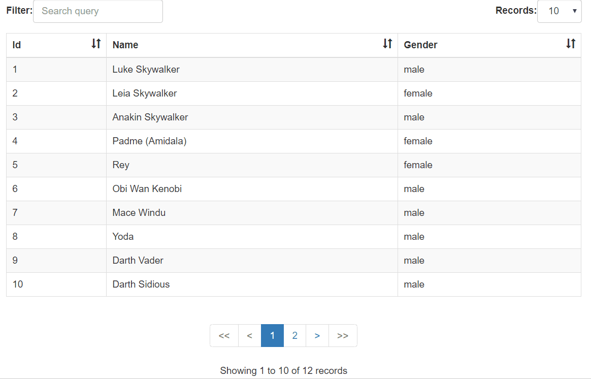
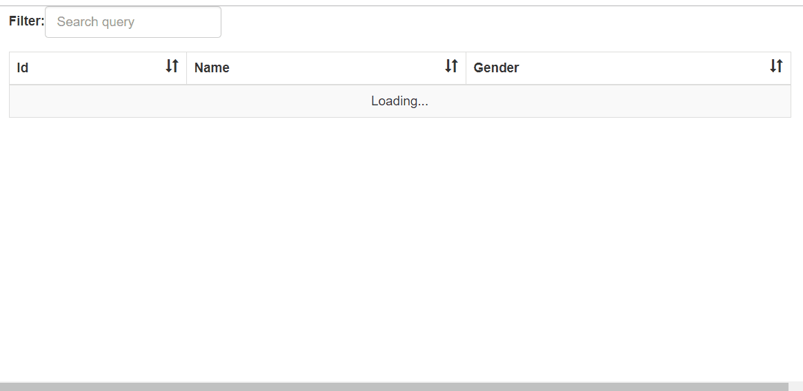

# vue-tables-2

> 表格套件

## Github

[matfish2/vue-tables-2](https://github.com/matfish2/vue-tables-2)


## 範例

### 註冊元件


註冊的方式：

```javascript
import {ServerTable, ClientTable, Event} from 'vue-tables-2';
Vue.use(ClientTable); //Client table
Vue.use(ServerTable); //Server table
```

或直接引用JS檔，

```html
<script src="https://cdn.jsdelivr.net/npm/vue-tables-2@1.4.70/dist/vue-tables-2.min.js"></script>

<script>
Vue.use(VueTables.ClientTable); //Client table
Vue.use(VueTables.ServerTable); //Server table
</script>
```


可額外指定參數：

```javascript
Vue.use(ClientTable, [options = {}], [useVuex = false], [theme = 'bootstrap3'], [template = 'default']);
```

例如：
```
Vue.use(ClientTable, {}, false, 'bootstrap3', 'default');
```

| Option | Description | Type | Default |
|:------:|:------------|:----:|:-------:|
| options  | | Object | {} |
| useVuex  | 是否使用[Vuex](https://vuex.vuejs.org/)做狀態管理 | Boolean | false |
| theme    | 選擇CSS framework，可為`bootstrap3`,`bootstrap4`,`bulma` | String | 'bootstrap3' |
| template | 選擇HTML樣板，例如`default`,`footerPagination`  | String | 'default' |


### Client table 

### 建立表格資料

#### HTML

```html
<v-client-table ref="myTable" :data="tableData" :columns="columns" :options="options"></v-client-table>
```


#### JS

```javascript
const FOO_DATA = [
    {id: 1, name:'Luke Skywalker',gender:'male', img:'https://goo.gl/KEUxHN'},
    ...
];

export default {
  name: "app",
  data() {
    return {
      columns: ["id", "name", "gender"],
      tableData: [],
      options: {}
    };
  },
  created() {
    this.tableData = FOO_DATA;
  }
};
```

#### Demo




若要取得目前已篩選的表格資料，可使用`ref`屬性以取得

1. allFilteredData: 所有已篩選資料 
2. filteredData: 目前分頁上的已篩選資料

```html
<v-client-table ref="myTable" :data="tableData" :columns="columns" :options="options"></v-client-table>
```

```javascript
//Get the filtered table data on current page
let showFilteredCurrentPageData =
      this.$refs.myTable.filteredData;

//Get the filtered table data on all pages
let showFilteredData = 
      this.$refs.myTable.allFilteredData;
```


### Server table

若資料需ajax後端的資料，則可改使用Server table。
支援以下三種ajax框架：
- [jquery](http://api.jquery.com/jquery.ajax/)
- [vue-resource](https://github.com/pagekit/vue-resource)
- [axios](https://github.com/axios/axios)

```html
<v-server-table url="http://localhost:3000/starwars" :columns="columns" :options="options"></v-server-table>
```

其中`url`指定了要取得資料的網址，其回傳的JSON必須包含`data`(Table data，格式為Array)及`count`(總筆數，格式為Number)。
例如：

```
"data":[
    {"id": 1,"name":"Luke Skywalker","gender":"male", "img":"https://goo.gl/KEUxHN"},
    //...skip the other 8 records
    {"id": 10,"name":"Darth Sidious","gender":"male","img":"https://goo.gl/QJiJWx"},
],
"count":100
```

當定義了`url`時，vue-tables-2將自動送出如下之request url:

```
http://localhost:3000/starwars?query=&limit=10&ascending=1&page=1&byColumn=0&orderBy=name
```

| Param | Description |
|:-----:|:------------|
| query | 查詢(篩選)的關鍵字 |
| page | 當前頁數 |
| orderBy | 排序的欄位 |
| ascending | 1: 升序，0: 降序 |
| byColumn | 當在`options`設定了`filterByColumn:true`(可BY欄位做篩選)，此值為 1，否則為 0 |


另若不使用上述三種ajax的框架或需客製送出request的方法，可透過設定`options`中的`requestFunction`方法。

```html
<v-server-table :columns="columns" :options="options"></v-server-table>
```

```javascript
options: {
    requestFunction: function (params) {
        return axios.get("http://localhost:3000/starwars", {
            params: params
        });
    }
}
```

#### Demo


