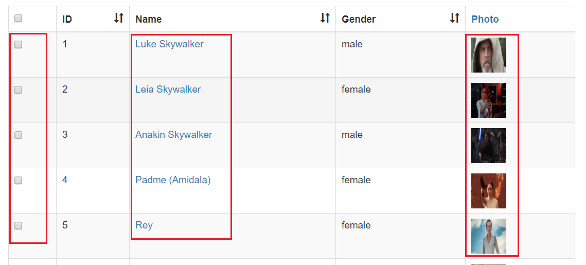

# vue-tables-2 (3)

> 表格套件，本篇主要說明如何在Template裡面使用自訂元件(Custom component)取代表格的顯示資料

## Github

[matfish2/vue-tables-2](https://github.com/matfish2/vue-tables-2)


## 範例

### Options: templates

假設我們建立了一個`MyCustomA`,`MyCustomB` components，可直接在Options裡面的`templates`指定**哪個欄位**的表格資料要套用哪個**元件**；

```html
<v-client-table :data="tableData" :columns="columns" :options="options" ></v-client-table>
```

#### 當建立Single page component時

```javascript
import MyCustomA from './components/my-custom-a';
import MyCustomB from './components/my-custom-b';

new Vue({
    el: "#app",
    components: { MyCustomA, MyCustomB },
    data: {
        columns: ["id", "name", "gender", "img"],
        tableData: [],
        options: {
            templates: {
                name: MyCustomA,
                img: MyCustomB
            }
        }
    }
});
```

或是也可直接命名載入的Component名稱和對應的欄位名稱相同，即可自動綁定對應的欄位：

```javascript
import name from './components/my-custom-a';
import img from './components/my-custom-b';

new Vue({
    el: "#app",
    components: { name, img },
    data: {
        columns: ["id", "name", "gender", "img"],
        tableData: [],
        options: {
            templates: {
                name
                img
            }
        }
    }
});
```


#### 當建立一般Component時

```javascript
Vue.component('my-custom-a', {
    //...
});

var app = 
  new Vue({
    el: "#app",
    data: {
        columns: ["id", "name", "gender", "img"],
        tableData: [],
        options: {
            templates: {
                name: "my-custom-a",
                img: "my-custom-b"
            }
        }
    }
});
```

### 改寫範例

我們在上一篇使用了Templates的[Scoped Slots](https://github.com/matfish2/vue-tables-2#scoped-slots)客製表格的顯示資料如下圖，



接下來我們將以Component的方式改寫，我們將需要三個Component：

1. VtCheckbox: 顯示勾選框，由於勾選動作會需要使用到vue-tables-2的Event bus，因此我們留到最後說明
2. VtEdit: 顯示包含超連結的姓名資訊 
2. VtImg: 顯示圖片


#### VtEdit component

```html
<template>
  <div>
    <a @click="edit(data.id)">{{ data.name }}</a>
  </div>
</template>

<script>
export default {
  name: "VtImg",
  props: ["data", "index", "column"],
  methods: {
      edit(id){
          alert("Redirect to edit page with id :" + id);
      }
  }
};
</script>
```

注意預設vue-tables-2會帶入三個props的值：

| Prop | Description | Type |
|:----:|:------------|:----:|
| data | 該筆row的資料 | Object |
| index | row index | Number  |
| column | 目標欄位 | String |

例如以下輸出：
```
data : {id: 10, name: "Darth Sidious", gender: "male", img: "https://goo.gl/QJiJWx", selected: false}
index : 10
column : name
```


#### VtImg component

```html
<template>
  <div>
    
  </div>
</template>

<script>
export default {
  name: "VtImg",
  props: ["data", "index", "column"],
  data() {
    return {
      src: "",
      alt: ""
    };
  },
  created() {
    this.src = this.data.img;
    this.alt = this.data.name;
  }
};
</script>
```


#### VtCheck component

在建立此元件時，我們須把實際Checkbox是否已勾選的值同步回父層的data: `tableData`的該筆資料。
方式為使用vue-tables-2的[Event](https://github.com/matfish2/vue-tables-2#events)：

1. Component在Checkbox勾選狀態改變時觸發`Event.$emit("vue-tables.<事件名稱>", <參數值>);`
2. 父層定義接收事件：`Event.$on('vue-tables.<事件名稱>', function (data) { })`


* Component:Event.$emit

```html
<template>
  <div>
      <input v-model="data.selected" type="checkbox" @change="changed"/>
  </div>
</template>

<script>
export default {
  name: "VtCheckbox",
  props: ["data", "index", "column"],
  data() {
    return {
    };
  },
  methods: {
    changed() {
      Event.$emit("vue-tables.checked", this.data);
    }
  }
};
</script>
```

* Parent:Event.$on

```html
 <v-client-table ref="myTable" :data="tableData" :columns="columns" :options="options" 
                               @checked></v-client-table>
```


```javascript
new Vue({
    el: "#app",
    //skip...
    created() {
        var vm = this;
        Event.$on('vue-tables.checked', function (data) {
            let row = vm.tableData.find(x=>x.id===data.id);
            row.selected = data.selected;
            console.log(row);
        });
    } 
});
```


> 若頁面上有多個vue-tables，這時候可設定`name`屬性，並指定Event綁定哪一個表格觸發和接收，例如以下範例。

```html
<v-client-table name="starwars"  :data="tableData" :columns="columns" :options="options" 
                @checked></v-client-table>
```

```javascript
//Emit
Event.$emit("vue-tables.starwars.checked", this.data);

//On
Event.$on('vue-tables.starwars.checked', function (data) {
    //Do something
});
```

#### 更新Options: templates

別忘了更新`templates`設定!

```javascript

new Vue({
    el: "#app",
    components: { VtImg, VtEdit, VtCheckbox },
    data: {
        columns: ["id", "name", "gender", "img"],
        tableData: [],
        options: {
            templates: {
                selected: VtCheckbox,
                name: VtEdit,
                img: VtImg
            }
        }
    },
    //Skip...
});
```

#### Demo


[Sample code](https://github.com/KarateJB/eBooks/tree/master/Vue.js/22.%20vue-tables-2%20(3)/sample%20code/app)

