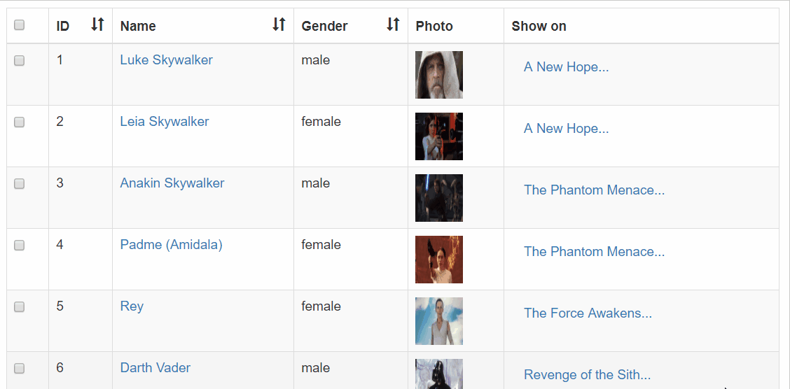

# vue-tables-2 (4)

> 表格套件，本篇主要說明如何顯示[Child rows](https://github.com/matfish2/vue-tables-2#child-rows)

## Github

[matfish2/vue-tables-2](https://github.com/matfish2/vue-tables-2)


## 範例

假設我們在`tableData`多了一個欄位：`showOn`:

```
[
    {id: 1, name:'Luke Skywalker',gender:'male', img:'https://goo.gl/KEUxHN', 
        showOn:[
            {id: "EP4", title: "A New Hope" },
            {id: "EP5", title: "The Empire Strikes Back" },
            {id: "EP6", title: "Return of the Jedi" },
            {id: "EP7", title: "The Force Awakens" },
            {id: "EP8", title: "The Last Jedi" }
        ]
    },
    ...
]
```


### Scoped slots

最快顯示該欄位的方式是利用[Scoped slots](https://github.com/matfish2/vue-tables-2#scoped-slots)將其顯示於一新欄位上；

```html
<v-client-table ref="myTable" :data="tableData" :columns="columns" :options="options">
    <template slot="showOn" slot-scope="props">
        <button v-show="!props.row.expanded" class="btn btn-link" 
                @click="(tableData.find(x=>x.id===props.row.id)).expanded=true">
            {{ props.row.showOn[0].title + "..." }}
        </button>
        <ul class="list-group" v-show="props.row.expanded">
            <li class="list-group-item"  v-for="ep in props.row.showOn" :key="ep.id">{{ep.title}}</li>
        </ul>
    </template>
</v-client-table>
```

```javascript
new Vue({
    el: "#app",
    components: { MyCustomA, MyCustomB },
    data: {
      columns: ["selected", "id", "name", "gender", "img", "showOn"],
      tableData: [],
      options: {
        sortable: ['id', 'name', 'gender'],
        headings: {
          showOn: "Show on",
          //skip other columns
        }
      }
    };
});
```

[Sample code](https://github.com/KarateJB/eBooks/blob/master/Vue.js/23.%20vue-tables-2%20(4)/sample%20code/app/src/components/scoped-slot-demo.vue)

#### Demo




### Virtual DOM function 

使用Options:`childRow`的設定搭配[Virtual DOM function](https://github.com/matfish2/vue-tables-2#virtual-dom-functions)可將Child row顯示在每筆主資料下面。

當設定了Options:`childRow`時，需注意：

* 每筆資料必須要有一個Unqiue id的欄位值(預設為使用`id`)以追蹤狀態及供事件判斷用。可在Options裡面額外設定`uniqueKey="OtherColName"另行指定
* vue-tables-2將自動於最前方新增一個欄位(`<td>`)如下，可利用底下的CSS class顯示Toggle圖示(例如"+"及"-")。

    ```html
    <td><span class="VueTables__child-row-toggler VueTables__child-row-toggler--closed"></span></td>
    ```

範例程式碼：

```html
 <v-client-table ref="myTable" :data="tableData" :columns="columns" :options="options">
</v-client-table>
```

```javascript
new Vue({
    el: "#app",
    data: {
      columns: ["selected", "id", "name", "gender", "img"],
      tableData: [],
      options: {
        uniqueKey: "id", //Used to track the child rows, and return the original row in row click event
        childRow: function(h, row) {
            return h(
              "ul",
              {
                attrs: {
                  class: "list-group"
                }
              }, row.showOn.map(s => {
                  return h(
                      "li", 
                      {
                          attrs:{
                              class:"list-group-item"
                            }
                    }, s.title)
              })
            );
        }
      }
    }
});
```


並直接使用[vue-tables-2](https://github.com/matfish2/vue-tables-2#child-rows)預設的CSS：

```css
.VueTables__child-row-toggler {
    width: 16px;
    height: 16px;
    line-height: 16px;
    display: block;
    margin: auto;
    text-align: center;
}

.VueTables__child-row-toggler--closed::before {
    content: "+";
}

.VueTables__child-row-toggler--open::before {
    content: "-";
}
```

[Sample code](https://github.com/KarateJB/eBooks/blob/master/Vue.js/23.%20vue-tables-2%20(4)/sample%20code/app/src/components/vdom-demo.vue)

#### Demo


### Component

我們也可以在Options:`childRow`指定使用[Component](https://github.com/matfish2/vue-tables-2#vue-components)的方式來顯示。

例如我們先建立一個`ShowOn` component (以Single page component為例): 

```html
<template>
    <ul class="list-group">
        <li class="list-group-item"  v-for="ep in data.showOn" :key="ep.id">{{ep.title}}</li>
    </ul>
</template>

<script>
export default {
  name: "ShowOn",
  props: ["data", "index", "column"],
  data() {
    return {
    };
  }
};
</script>
```

並指定給vue-tables-2的Options:`childRow`：

```javascript
import ShowOn from "./show-on"

new Vue({
    el: "#app",
    components: { ShowOn },
    data: {
        options: {
                childRow: ShowOn,
                //Skip..
        }
    },
}
```

> 若註冊一般的Component，則設定為: `childRow: "show-on",`


[Sample code](https://github.com/KarateJB/eBooks/blob/master/Vue.js/23.%20vue-tables-2%20(4)/sample%20code/app/src/components/component-demo.vue)

#### Demo


