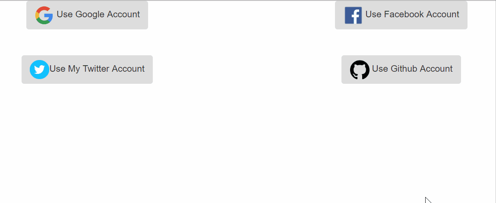

# VueFire

> [Google Firebase](https://firebase.google.com)的Vue.js官方套件，本篇介紹登入(出)及使用VueFire的Realtime Database Bindings

## Github

[vuejs/vuefire](https://github.com/vuejs/vuefire)

## 安裝

```
$ npm install firebase
$ npm install vuefire
```

## Firebase

我們先在Firebase開一個Realtime Database，建立如下的JSON資料和驗證規則：

```json
{
  "Demo" : {
    "products" : {
      "3a30b4b6-8fe5-48cf-9aab-06f431257928" : {
        "id" : "3a30b4b6-8fe5-48cf-9aab-06f431257928",
        "price" : "2500",
        "title" : "Implementing Domain-Driven Design",
        "type" : "Book",
        "typeId" : "1"
      },
      "6cfd8b64-0ff2-4bde-8278-befaa2f4e42f" : {
        "id" : "6cfd8b64-0ff2-4bde-8278-befaa2f4e42f",
        "price" : "500",
        "title" : "Toy Robot",
        "type" : "Toy",
        "typeId" : "2"
      },
      "800afd3c-1615-49ba-b33d-497842af6c82" : {
        "id" : "800afd3c-1615-49ba-b33d-497842af6c82",
        "price" : "1000",
        "title" : "Star Wars",
        "type" : "Book",
        "typeId" : "1"
      },
      "fa7ece70-6f5c-41a2-a7a6-cd03ca3d0136" : {
        "id" : "fa7ece70-6f5c-41a2-a7a6-cd03ca3d0136",
        "price" : "800",
        "title" : "Essential Scrum",
        "type" : "Book",
        "typeId" : "1"
      }
    }
  }
}
```


```json
{
  "rules": {
    "Demo":
    	{
        "products":{
          ".read": "auth != null"
        }
      }
    }
}
```

## 配置

```javascript
import VueFire from 'vuefire'

/* firebase */
import firebaseConfig from './modules/firebase.config.prod'
// import * as firebase from 'firebase' //Dev mode
import firebase from 'firebase/app'
import 'firebase/auth'
import 'firebase/database'

//firebase
const firebaseConfig = {
    apiKey: "xxxxxx",
    authDomain: "xxxx.firebaseapp.com",
    databaseURL: "https://xxxx.com",
    projectId: "xxxxx",
    storageBucket: "xxxxx",
    messagingSenderId: "xxxxx"
};

const firebaseApp = firebase.initializeApp(firebaseConfig);
window.firebase = firebase;
window.firebaseDb = firebaseApp.database();
window.firebaseAuth = firebaseApp.auth();

Vue.use(VueFire)
```


## 登入/登出

我們使用[firebase/firebase-js-sdk](https://github.com/firebase/firebase-js-sdk)來完成Google Account驗證。

```html
<template>
  <div class="card">
    <div class="card-block">
        <div class="card-text">
            <div v-if="!isAuth" class="text-center">

                <div class="container">
                    <div class="row">
                        <div class="col-md-6">
                            <button class="btn btn-toolbar" @click="login('google')">
                                
                                Use Google Account
                            </button>
                        </div>
                    </div>
                </div>
            </div>
            <div v-else class="text-center">
                <table class="table">
                    <tr>
                        <td class="text-center">
                            <label class="control-label">{{ user.displayName }}</label>
                        </td>
                    </tr>
                    <tr>
                        <td class="text-center">
                             
                        </td>
                    </tr>
                    <tr>
                            <td class="text-center">
                                Phone number: <label class="control-label">{{ user.phoenNumber || '(no phone number)'}}</label>
                            </td>
                        </tr>
                    <tr>
                        <td class="text-center">
                            Email: <label class="control-label">{{ user.email || '(no email)'}}</label>
                        </td>
                    </tr>                 
                </table>
                <div>
                    <input type="button" class="btn btn-warning" @click="logout" value="Logout" />
                </div>
            </div>
        </div>
    </div>
  </div>
</template>

<script>

export default {
  name: "login",
  data() {
    return {
      user: null,
      isAuth: false //Is authorized flag
    };
  },
  methods: {
    login(providerName) {
      let provider = null;
      switch (providerName) {
        case "google":
          provider = new firebase.auth.GoogleAuthProvider();
          break;
      }

      firebaseAuth.signInWithPopup(provider)
        .then(result => {
          this.user = result.user;

        }).catch(err => console.error(err));
    },

    logout() {
      firebaseAuth.signOut()
        .then(() => {
          this.user = null;
          this.isAuth = false;
        }).catch(err => console.log(error));
    }
  },
  beforeCreate(){
      firebaseAuth.onAuthStateChanged((user) => {
        if (user) {
          this.user = user;
          this.isAuth = true;
        }
      })
  },
  created() {
      console.log(firebaseDb);
      console.log(firebaseAuth);
  }
};
</script>
```

### Demo




## Array/Object bindings

```html
<pre>{{ fbObject }}</pre>
<table class="table">
<thead class="thead-dark">
    <tr>
    <th>Type</th>
    <th>ID</th>
    <th>Title</th>
    <th>Price</th>
    </tr>
</thead>
<tbody>
    <tr v-for="item in fbArray" :key="item.id">
    <td>{{ item.type }}</td>
    <td>{{ item.id }}</td>
    <td>{{ item.title }}</td>
    <td>{{ item.price }}</td>
    </tr>
</tbody>
</table>
```


```javascript
new Vue({
    el: "#app",
    firebase: {
      fbArray: firebaseDb.ref('Demo/products').limitToLast(10), //bind as an array
      fbObject: {
        source: firebaseDb.ref('Demo/products/800afd3c-1615-49ba-b33d-497842af6c82'),
        asObject: true, //Bind as object
        cancelCallback: function () { },
        readyCallback: function () { }
    }
  }
});
```

結果：


