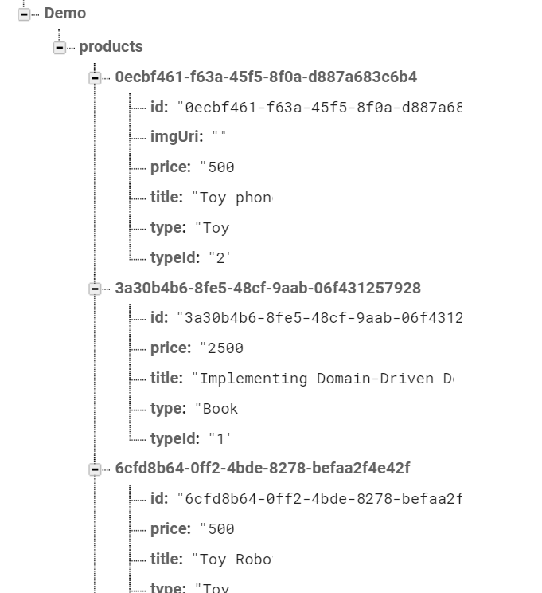
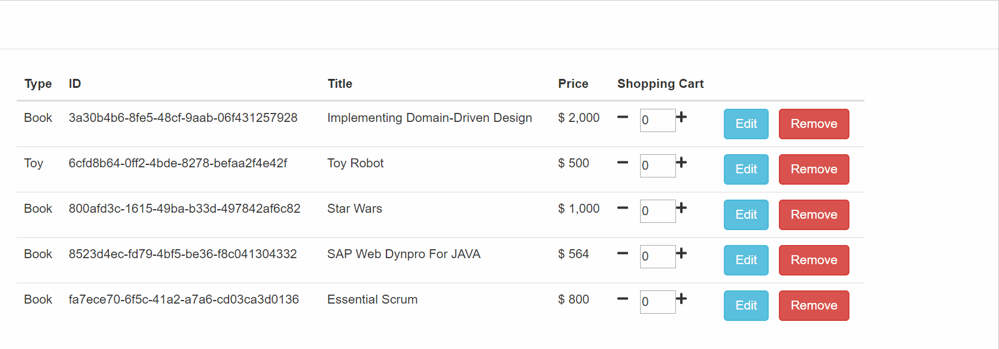
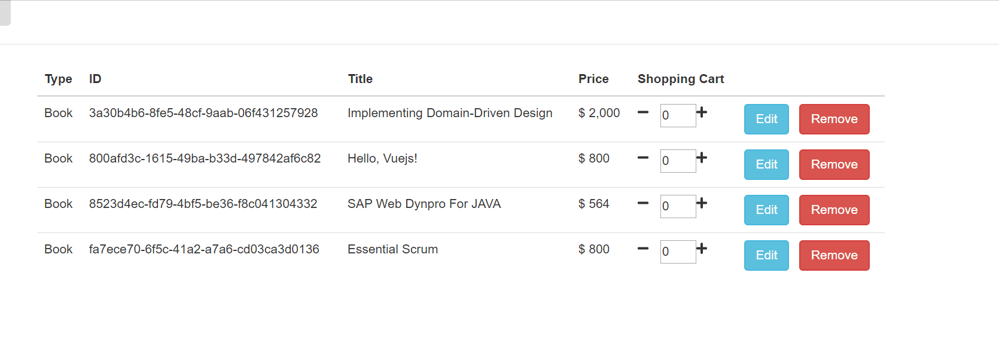

# VueFire (2)

> [Google Firebase](https://firebase.google.com)的Vue.js官方套件，本篇透過[VueFire](https://github.com/vuejs/vuefire)實作Realtime Database的CRUD功能

## Github

[vuejs/vuefire](https://github.com/vuejs/vuefire)


## 範例

以下範例將延續[VueFire (1)](https://github.com/KarateJB/eBooks/tree/master/Vue.js/27.%20VueFire%20(1))的Firebase Realtime的設定和資料。

### Read

我們在[上一篇](https://github.com/KarateJB/eBooks/tree/master/Vue.js/27.%20VueFire%20(1))示範了在Vue instance裡指定`firebase`來綁定Firebase的資料成Array或Object，

```javascript
new Vue({
    el: "#app",
    firebase: {
      fbArray: firebaseDb.ref('Demo/products').limitToLast(10), //bind as an array
      fbObject: {
        source: firebaseDb.ref('Demo/products/800afd3c-1615-49ba-b33d-497842af6c82'),
        asObject: true, //Bind as object
        cancelCallback: function () { },
        readyCallback: function () { }
    }
  }
});
```


也可以利用以下語法做Array/Object bindings：

```javascript
this.$bindAsArray('fbArray', firebaseDb.ref('Demo/products').limitToLast(25));
this.$bindAsObject('fbObject', firebaseDb.ref('Demo/products').child('800afd3c-1615-49ba-b33d-497842af6c82'));
```

> 每筆binding出來的資料(Object bindings或在Array bindings裡面的每筆資料)的兩個prop：
>
> - `.key` : Key值
> - `.value` : 當其值不為物件時，例如String/Boolean/Number，則將值放在此


當綁定資料到`fbArray`和`fbObject`兩個變數後，就可以利用以下語法取得資料的Reference，後面會提到利用此Reference來做Set(設值)或Remove(移除)。

```javascript
let ref = this.$firebaseRefs.fbObject
```


#### Demo




### Remove

可透過呼叫Reference的`remove`方法刪除資料。

```javascript
this.$bindAsObject(
    'removeObject', 
    firebaseDb.ref('Demo/products').child(key));

this.$firebaseRefs.removeObject.remove().then(()=>{
    alert("The data has been removed!");
    this.$unbind('removeObject');
});
```

#### Demo




### Create

有兩種方式：

1. Object bindings then Set

先指定`key`再利用呼叫Reference的`set`方法寫入資料(注意會Overwrite該`key`值底下的所有資料)。

```javascript
this.$bindAsObject(
    "fbObject",
    firebaseDb.ref("Demo/products").child(this.prod.id)
);

this.$firebaseRefs.fbObject
    .set(this.prod)
    .then(() => {
        alert("The data has been saved!");
    })
    .catch(e => console.error("Error! Access denied!"));
```


2. Array bindings then Push 

```javascript
this.$bindAsArray('fbArray', firebaseDb.ref('Demo/products'));
this.$firebaseRefs.fbArray.push(this.prod);
```


#### Demo


### Update

更新仍可使用Set的方式，但須注意需保留不更動欄位的值(因為會整個Overwrite)，另外需從物件中移除`.key`屬性。

```javascript
let updatedObject = { ... };

delete updatedObject[".key"]; //Must remove the ".key" property, see https://github.com/vuejs/vuefire#data-normalization

this.$firebaseRefs.fbObject
    .set(updatedObject)
    .then(() => {
        alert("The data has been saved!");
    })
    .catch(e => console.error("Error! Access denied!"));
```

或是透過只綁定該資料底下的某個欄位來做更新：

```javascript
this.$bindAsObject("myProp", firebaseDb.ref("Demo/products").child(key) + "/title"));
this.$firebaseRefs.myProp.set("Hello, Vuejs!");
```

#### Demo




[Sample code](https://github.com/KarateJB/Vue.Firebase.Sample)


