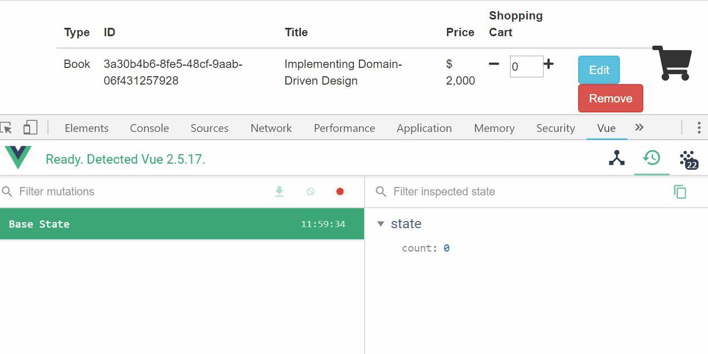

# vuex (1)

> Vue.js官方的狀態管理套件，本篇利用簡單範例來介紹入門用法

## Github

[vuejs/vuex](https://github.com/vuejs/vuex)


## 安裝

```
$ npm install vuex --save
```

## 註冊

```javascript
import Vuex from 'vuex'

Vue.use(Vuex);
```

## 開始第一個vuex範例

再往下之前，我們先透過底下官網提供的vuex概念圖(Pattern)來理解各角色的職責：

* State
* Actions
* Mutations


來源：[Vuex - What is Vuex?](https://vuex.vuejs.org/#what-is-vuex)

我們開始撰寫一個簡單的範例，利用vuex來對一個數量變數(`count`)先忽略Actions而直接透過Mutations做狀態管理，
包含：
* Increment 數量加一 
* Decrement 數量減一
* Reset 數量歸零


#### vuex store (myStore.js)

```javascript
import Vue from 'vue';
import Vuex from 'vuex'
Vue.use(Vuex)

export const INCREMENT = 'increment';
export const DECREMENT = 'decrement';
export const RESET = 'reset';

export const store = new Vuex.Store({
    state: {
      count: 0
    },
    mutations: {
      increment (state) {
        state.count++;
      },
      decrement(state){
          if(state.count > 0)
            state.count--;
      },
      reset(state){
          state.count= 0;
      }

    }
})
```

#### Usage 

```javascript
import {store, INCREMENT, DECREMENT, RESET} from "myStore";

//Increment
store.commit(INCREMENT);
//Decrement
store.commit(DECREMENT);
//Reset
store.commit(RESET);
```

底下透過[vue-devtools](https://github.com/vuejs/vue-devtools)觀察vuex store的變化；





## 注入vuex store到所有子元件


我們可以使用以下方式開啟注入vuex store到所有子元件(Child components)，可省略在每個Component重複import `myStore.js`:

```javascript
import Vue from 'vue';
import Vuex from 'vuex'
Vue.use(Vuex)

var app = new Vue({
  el: '#app',
  store,
  components: { A, B, C },
})
```

如此可在A,B,C三個components裡面以全域方式取得vuex store：

```javascript
 //Increment
 this.$store.state.count++;
//Decrement
 this.$store.state.count--;
//Reset
 this.$store.state.count=0;
```


## 搭配Computed property取得狀態值

一般會將狀態值以Computed property的方式來取用：

```javascript
computed: {
    count () {
      return this.$store.state.count;
      
      //Or by importing the singleton vuex store
      //return store.state.count
    }
}
```

可透過[mapState](https://vuex.vuejs.org/guide/state.html#the-mapstate-helper) helper來取代以上寫法；

```javascript
computed: mapState({
    count: state => state.count, //Assign the computed prop: count, as state.count
    countAlias: 'count', //Optional: assign the other computed prop: countAlias, which is as same as "count"
    
    //Also can declare the computed variable as function
    nextCount(state) { 
        return state.count + STEP;
    },
    previousCount(state){
        return state.count - STEP;
    }
})
```

注意`mapState(...)`回傳的是object； 如果要配合使用Local computed properties，可透過[object rest/spread operator](https://tc39.github.io/proposal-object-rest-spread/)以下列簡潔的方式來宣告;

> Reference:
> - [tc39/proposal-object-rest-spread](https://github.com/tc39/proposal-object-rest-spread)
> - [Spread syntax](https://developer.mozilla.org/en-US/docs/Web/JavaScript/Reference/Operators/Spread_syntax)
> - [展開運算子(Spread Operator)與其餘參數(Rest parameters)](http://eddychang.me/blog/16-javascript/45-spread-operator-rest-parameters.html)


```javascript
computed: {
    currentDatetime() { //This is a local computed prop for sample
      return new Date();
    },
    // mix mapState by object spread operator
    ...mapState({
      count: state => state.count,
      countAlias: "count",
      nextCount(state) {
        return state.count + STEP;
      },
      previousCount(state) {
        return state.count - STEP;
      }
    })
  },
```


#### Usage 

```javascript
console.log('current: ' + this.count);
console.log('next: ' + this.nextCount);
console.log('previous: ' + this.previousCount);
```
